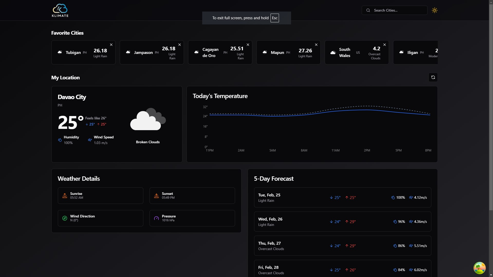

# 🌤️ Weather App

A modern weather application built with **React (TSX)**, powered by the **OpenWeather API**. Styled using **ShadCN** for a clean and elegant UI. The app provides **real-time weather updates** and a **5-day forecast**.

## 🚀 Features

- 🌍 **Real-time Weather Data** - Get live weather conditions based on your location or search.
- 📅 **5-Day Forecast** - View upcoming weather trends.
- 📌 **Geolocation Support** - Automatically fetches weather data based on your current location.
- 🎨 **ShadCN UI Components** - Modern and accessible UI elements.
- 🌑 **Dark Mode Support** - Seamless light/dark mode switching.

## 🛠️ Tech Stack

- **React (TSX)** - Frontend framework
- **Vite** - Fast build tool
- **OpenWeather API** - Fetches weather data
- **ShadCN** - UI styling
- **Tailwind CSS** - Utility-first styling
- **TypeScript** - Type safety and improved development experience

## 📦 Installation & Setup

1. **Clone the repository**
   ```sh
   git clone https://github.com/yourusername/weather-app.git
   cd weather-app
   ```

2. **Install dependencies**
   ```sh
   npm install
   ```

3. **Set up environment variables**
   - Create a `.env` file in the root directory and add:
     ```sh
     VITE_OPENWEATHER_API_KEY=your_api_key_here
     ```

4. **Run the app**
   ```sh
   npm run dev
   ```

5. **Deploying on Vercel (Recommended)**
   ```sh
   npm install -g vercel
   vercel
   ```

## 🌎 API Usage

The app fetches weather data from OpenWeather's API. Make sure to get your free API key from [OpenWeather](https://openweathermap.org/).

## 🎨 UI Preview



## 📝 License

This project is open-source under the **MIT License**.

---

💡 **Want to contribute?** Feel free to open an issue or submit a pull request! 🚀

